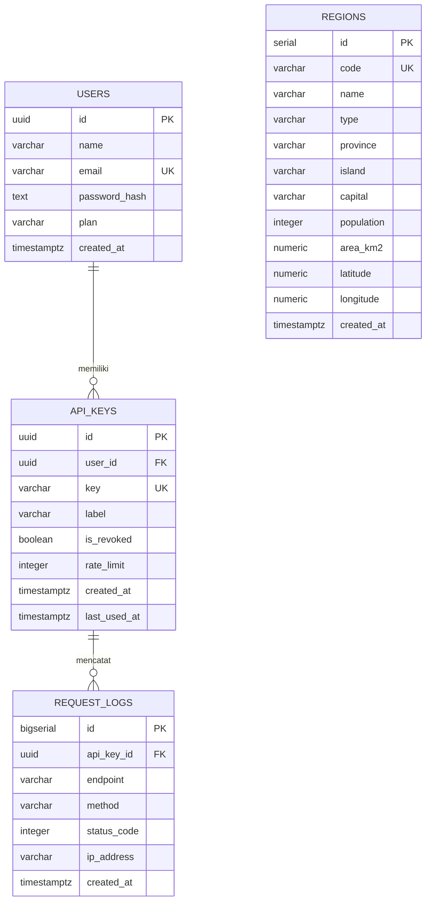

# IndoRegion API

SaaS REST API yang menyediakan data wilayah administratif Indonesia
(provinsi, kabupaten/kota) — mirip pola OpenWeather/OpenRouter: daftar
lewat email/password (JWT), buat API key, lalu pakai API key itu untuk
mengakses data produk (endpoint `/v1/...`).

> **Catatan data**: populasi dan luas wilayah pada data seed adalah
> **nilai perkiraan untuk keperluan demo/latihan**, bukan data resmi BPS
> terbaru. Untuk kebutuhan produksi nyata, ganti dengan data resmi.

## Tech Stack
- **Express.js** — REST API framework
- **PostgreSQL (Supabase)** — database
- **JWT (jsonwebtoken)** — autentikasi user (register/login)
- **API Key** — autentikasi akses data (header `x-api-key`)
- **Vercel** — deployment (serverless function)

## Fitur
- Register & login user, token JWT
- User bisa membuat, melihat, dan mencabut (revoke) banyak API key
- Endpoint data wilayah dengan filter, pencarian, dan pagination
- Endpoint statistik agregat per provinsi
- Rate limiting harian sederhana per API key (default 100 req/hari)
- Logging setiap request ke tabel `request_logs` untuk analitik penggunaan

---

## 1. Skema Database (ERD)

4 tabel: `users`, `api_keys`, `regions`, `request_logs`.



Catatan: `REGIONS` tidak punya foreign key ke tabel lain — ia adalah
tabel data produk yang independen, diakses lewat API key (bukan relasi
langsung ke user), sesuai pola SaaS data-provider (seperti weather API).

Lihat juga file `docs/laporan/` untuk versi PDF lengkap (ERD, Use Case
Diagram, Activity Diagram/userflow beserta narasi penjelasannya).

---

## 2. Struktur Proyek

```
indoregion-api/
├── api/
│   └── index.js          # entry point serverless untuk Vercel
├── src/
│   ├── app.js             # setup Express app + routes
│   ├── config/db.js       # koneksi pool PostgreSQL
│   ├── middleware/
│   │   ├── authJwt.js     # proteksi route via JWT (dashboard user)
│   │   └── authApiKey.js  # proteksi route via API key (data produk)
│   ├── controllers/
│   │   ├── authController.js
│   │   ├── apiKeyController.js
│   │   └── regionController.js
│   └── routes/
│       ├── authRoutes.js
│       ├── apiKeyRoutes.js
│       └── regionRoutes.js
├── db/
│   ├── schema.sql         # DDL 4 tabel
│   └── seed_data.json     # 61 baris data wilayah
├── scripts/
│   ├── migrate.js         # jalankan schema.sql ke database
│   └── seed.js            # isi tabel regions
├── vercel.json
├── package.json
└── .env.example
```

---

## 3. Menjalankan Secara Lokal

### Prasyarat
- Node.js ≥ 18
- Akun [Supabase](https://supabase.com) (gratis) — atau PostgreSQL lokal untuk uji coba

### Langkah

```bash
git clone <url-repo-anda>
cd indoregion-api
npm install
cp .env.example .env
# isi .env: JWT_SECRET dan DATABASE_URL
npm run migrate   # membuat 4 tabel
npm run seed       # mengisi 61 data wilayah
npm run dev         # jalan di http://localhost:3000
```

---

## 4. Setup Database di Supabase

1. Buat project baru di [supabase.com](https://supabase.com)
2. Buka **Project Settings → Database → Connection string**, pilih tab
   **Connection pooling** (mode *Transaction*, port `6543`) — **wajib**
   pakai yang ini untuk Vercel, bukan port `5432` langsung, karena
   fungsi serverless membuka banyak koneksi singkat dan port 5432 akan
   cepat kehabisan slot koneksi.
3. Salin connection string tersebut ke `DATABASE_URL` di `.env`
4. Jalankan `npm run migrate` lalu `npm run seed` dari komputer lokal
   (cukup sekali, tidak perlu diulang setiap deploy)

---

## 5. Deploy ke Vercel

```bash
npm install -g vercel
vercel login
vercel                # deploy pertama kali (ikuti prompt)
vercel env add JWT_SECRET production
vercel env add DATABASE_URL production
vercel --prod         # deploy ke production setelah env diisi
```

Atau lewat dashboard vercel.com: **Import Project** dari GitHub repo →
tambahkan Environment Variables (`JWT_SECRET`, `DATABASE_URL`) → Deploy.

---

## 6. Dokumentasi Endpoint

### Autentikasi (publik)

| Method | Endpoint | Body | Deskripsi |
|---|---|---|---|
| POST | `/auth/register` | `{ name, email, password }` | Daftar akun baru, mengembalikan JWT |
| POST | `/auth/login` | `{ email, password }` | Login, mengembalikan JWT |

### Manajemen API Key (butuh JWT — header `Authorization: Bearer <token>`)

| Method | Endpoint | Body | Deskripsi |
|---|---|---|---|
| POST | `/api-keys` | `{ label? }` | Buat API key baru |
| GET | `/api-keys` | – | Daftar API key milik user |
| GET | `/api-keys/usage` | – | Statistik pemakaian 24 jam terakhir per key |
| DELETE | `/api-keys/:id` | – | Cabut (revoke) API key |

### Data Wilayah (butuh API key — header `x-api-key: <key>`)

| Method | Endpoint | Query | Deskripsi |
|---|---|---|---|
| GET | `/v1/regions` | `province, type, island, search, page, limit` | Daftar wilayah + pagination |
| GET | `/v1/regions/:code` | – | Detail satu wilayah by kode |
| GET | `/v1/regions/stats` | – | Agregat populasi/luas/densitas per provinsi |

### Contoh pemakaian

```bash
# 1. Register
curl -X POST https://<domain-anda>.vercel.app/auth/register \
  -H "Content-Type: application/json" \
  -d '{"name":"Budi","email":"budi@mail.com","password":"rahasia123"}'

# 2. Buat API key (pakai token dari langkah 1)
curl -X POST https://<domain-anda>.vercel.app/api-keys \
  -H "Authorization: Bearer <JWT_TOKEN>" \
  -H "Content-Type: application/json" \
  -d '{"label":"aplikasi-saya"}'

# 3. Ambil data (pakai API key dari langkah 2)
curl "https://<domain-anda>.vercel.app/v1/regions?province=Jawa%20Barat" \
  -H "x-api-key: <API_KEY>"
```

---

## 7. Lisensi
MIT — bebas dipakai untuk keperluan belajar/tugas.
